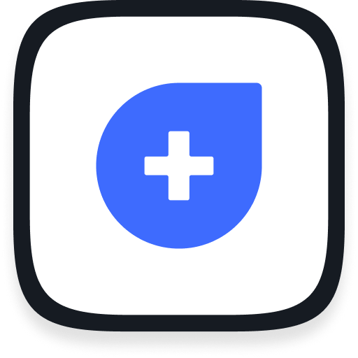
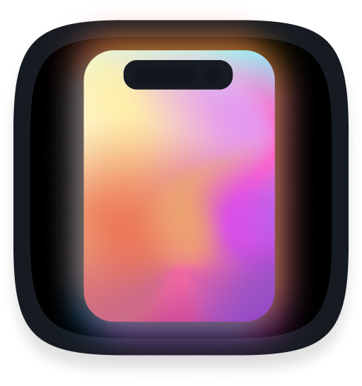
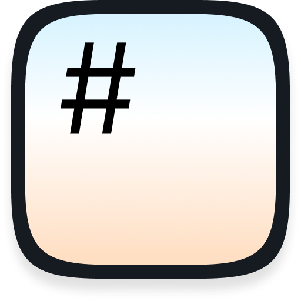

## Hello! ¡Hola! こんにちは! Terve! Привет!

🔥 **I’m currently working on:**
 -  [LifetimeHealth](https://lifetimehealth.in) - StartUp project in India
 -  Squiddy-Labs - my own project, AppStore is [**coming soon**]

📚 **My articles:**
 - Abstraction in Swift - [ENG](https://dev.to/kovs705/abstraction-in-swift-a-comparative-look-at-kotlin-and-swift-4ole), [RU](https://habr.com/ru/articles/782834/)

📦 **My packages:**
 -  [NotchTransition](https://github.com/kovs705/NotchTransition) - Custom navigation transition from the iPhone's notch
 -  [Preview Debugger](https://github.com/kovs705/PreviewDebugger) - Accessibility, UI and locale directly in your SwiftUI testing environment
 -  [AccessDenied](https://github.com/kovs705/AccessDenied) - Hide sensitive content in SwiftUI
 -  [MDEdittttor](https://github.com/kovs705/MDEdittttor) - Markdown Editor Package (UIKit/SwiftUI)

🧐 **Additional resources:**
 - 🌌 [iOS 26 Glass](https://gist.github.com/kovs705/06c770c288e726cb5f862917f899de71) - Support new Glass Effect without errors
 - 📁 [Git ignore](https://github.com/kovs705/KMP-git-ignore) - Git ignore template for iOS project
 - 💼 [iOS Scripts](https://github.com/kovs705/iOSScripts) - 4 different scripts and executable apps
 - 🔨 [Xcode 15.2 Header files](https://github.com/kovs705/Xcode15-RuntimeHeaders) - headers of Xcode under the hood
 - 🧪 [Useful Links](https://gist.github.com/kovs705/c047c7fb17e0bb788997e7a87b33bb52) - My small list of useful links for better development

📫 **You can also find me there:**
 - [My Gists page](https://gist.github.com/kovs705)
 - [My Telegram](https://t.me/kovs705) - @kovs705
 - [My LinkedIn](https://www.linkedin.com/in/kovs705/)
 - [My Page](https://kovs705.github.io/PVresume/)
